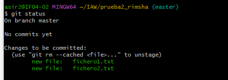

#   EJERCICIO 1 (14)
## 14- Vamos a crear un nuevo repositorio llamado prueba2_tu_nombre. Ten en cuenta lo siguiente:  

    

* ##  En esta ocasión, crea primero el repositorio local en Windows (usando git init). El repositorio debe contener, al menos, dos archivos de texto: archivo1.txt y archivo2.txt. El contenido de ambos archivos es libre. 

  
  
  
  
   

* ##  Agrega (conecta) el repositorio local con un repositorio remoto en GitHub (usando git remote add).   
  
  
* ##  Sube el repositorio local a GitHub (usando git push).
  

* ## Clona el repositorio remoto en tu máquina virtual Linux Debian (usando git clone). 
### Creación de un fichero  

  
   
  
### Modificación del fichero   
  
    
  
  
  
  
  
  

* ## Modifica, en Windows, uno de los archivos y añade un 3º archivo de texto llamado archivo3.txt. Confirma los cambios(usando git add, git commit) y súbelos al repositorio (usando git push). 

  

* ## Actualiza la versión local del repositorio en Linux Debian (usando git pull). 
  
