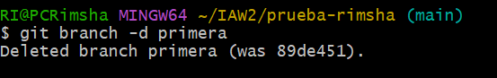
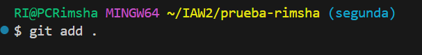

# Ejercicio 3  
<!-- Crea una rama que se llame primera en un repositorio local, y ejecuta la instrucción necesaria para comprobar que se ha creado -->
Voy a mi repositorio **preuba_rimsha**  

  

Con el comando **git branch** podemos ver las ramas que tenemos    

    

con el comando **git branch primera** creamos una rama  

  

Con el comando **git checkout primera** cambiamos a rama primera  

  

Con **git branch** confirmamos cambio de rama

  
<!-- Crea un nuevo fichero en esta rama y fusiónalo con la principal. ¿Se ha producido conflicto? Razona la respuesta.
Borra la rama primera. -->
en este rama voy a crear un fichro **fich_pri.txt**

  

Con el comando **git add .** Agregamos los archivos modificados o creados a la cola para que se confirmen más tarde.Los archivos no se confirman.

  

Con **git commit** confirmamos los archivos que se han agregado y crea una nueva revisión con un registro

  

Con **git checkout main** cambio la rama a main

  

Con el comando **git merge primera** fusiónamos los modificaciones con la rama principal(main)

  
<!-- Borra la rama primera.-->
Con el comando **git branch -d** eliminamos la rama primera  
No se ha producido conflicto porque el nuevo fichero no existía en la rama principal, por lo que Git puede realizar una fusión sin problemas.  

  
<!-- Crea una rama que se llame segunda, y modifica un fichero en ella para producir un conflicto al unirlo a la rama principal. Entrega el contenido del fichero donde se ha producido el conflicto. -->
Otra vez creamos una rama uneva se llama **"Segunda"**  
Modificamos el fichero **fich_pri.txt** que hemos creado anteriormente.  

  

Modifico fichero **fich_pri.txt**

  

Con el comando **git add .** Agregamos el archivo modificado a la cola para que se confirmen más tarde.El archivos no se confirman.

 

Con **git commit** confirmamos el archivo que se he modificado y crea una nueva revisión con un registro.

  

Cambio la rama a main  

  

Aqui tambien modifico este mismo fichero **fich_pri.txt**

  

Con el comando **git add .** Agregamos el archivo modificado a la cola para que se confirmen más tarde.El archivos no se confirman.  

  

Con **git commit** confirmamos el archivo que se he modificado y crea una nueva revisión con un registro. 

  

Aqui aparece un conflicto porque es como diferentes personas estan trabajando con el mismo archivo simultáneamente y cuando se realizan cambios en paralelo en diferentes ramas que afectan a las mismas líneas de código.

  

Borramos que no queremos por ejemplo linea de  **HEAD**, **Ultima linea** y una en la media. y como este resolvemos el conflicto. Y ahora podemos ralizar cambios sin problema.

  

Con el comando **git add .** Agregamos los archivos modificados o creados a la cola para que se confirmen más tarde.Los archivos no se confirman.

  

Con **git commit** confirmamos los archivos que se han agregado y crea una nueva revisión con un registro

  
  
Ahora podems hacer merge sin problemas.  

  
  
vamos a rama segunda para confirmar que si tiene mismo contenido. 

**¡FINSH!**