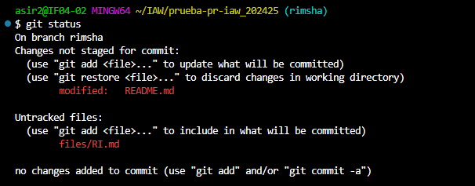

# Ejercicio 4: ¿Cómo colaborar en un proyecto de software libre? ¿Qué es un Pull Request (PR)?”  
Visitamos https://github.com/lgarciavelazquez/prueba-pr-iaw_202425, este es nuesto repositorio principal, donde tenemos que crear fork. Para un trabajo distrubuida.   

  

Al lado del fork hay un flechito desde donde creamos el directorio.  

  

Aqui creamos nuestro repositorio prueba1_1 incluido README.md fichero.  

  

Ya esta creada, contiene 2 ficheros files y README.md.

  

con el comando de **git clone** clonamos repositorio en equipo local.  

  

Con **ls** confirmamos si esta en la lista o no.

  

Cambiamos directorio a este repositorio  

  

Con **git branch rimsha** creamos nueva rama.

  

Confirmamos si es en la lista o no.  

  

Con el comando **git checkout** cambiamos la rama.

  

Aqui listamos el contenido.  

  

En el directorio de **files** creamos un nuevo fichero **RI.md**  

  

Confirmamos si existe o no.  

  

Luego en el fichero **README.md** añadimos la ruta del fichero que hemos creado anteriormente.  

  

Con el comando **git status** vemos el estado real de los ficheros que hemos modificado.  

     

Con el comando **git add .** y **git commit**  subimos el fichero al repositorio local.  

  
  

Con el comando **git push** subimos los cambios al repositorio remoto.  

  

Luego vamos al repositorio remoto y desde aqui hacemos clic en el botón de **compare & pull request**.  

  

Creamos el **pull request**.  

  

Finalizamos el request.  

  

